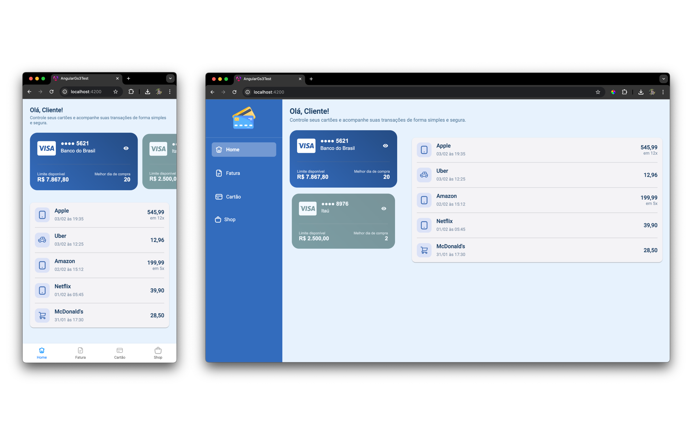

# 📱 Aplicativo de Cartões

Este aplicativo exibe uma lista de cartões do cliente, permitindo visualizar transações e informações relevantes de cada cartão. Foi desenvolvido em **Angular**, com foco em **web**, podendo ser acessado pelo navegador do celular.

## 📸 Capturas de Tela

### Telas



## 🚀 Tecnologias Utilizadas

- **Linguagem:** TypeScript
- **Framework:** Angular
- **Arquitetura:** MVVM (Model-View-ViewModel)
- **Gerenciamento de estado:** Serviços Angular

## 📂 Estrutura do Projeto

A estrutura do projeto é organizada de forma modularizada:

```
/src
 ├── app
 │   ├── models              # Modelos de dados
 │   ├── services            # Serviços e requisições HTTP
 │   ├── viewmodels          # ViewModels (lógica de negócios e estado)
 │   ├── components          # Componentes reutilizáveis
 │   │   ├── widgets         # Widgets da aplicação
 │   │   ├── pages           # Telas da aplicação
 ├── core
 │   ├── shared              # Componentes compartilhados (AppBar, Navbar, etc.)
```

## 📌 Instruções para Execução

### Pré-requisitos

Certifique-se de ter instalado:

- **Node.js** ([https://nodejs.org](https://nodejs.org))
- **Angular CLI** ([https://angular.io/guide/setup-local](https://angular.io/guide/setup-local))

### Como rodar o projeto

1. Clone o repositório:

   ```bash
   git clone https://github.com/origemjhanpoll/angular_gs3_test
   cd angular_gs3_test
   ```

2. Instale as dependências:

   ```bash
   npm install
   ```

3. Execute o aplicativo:

   ```bash
   ng serve
   ```

4. Abra o navegador e acesse:

   ```bash
   http://localhost:4200
   ```

## 🤝 Contribuição

Sinta-se à vontade para abrir issues ou contribuir com melhorias!

## 📄 Licença

Este projeto está sob a licença MIT.
